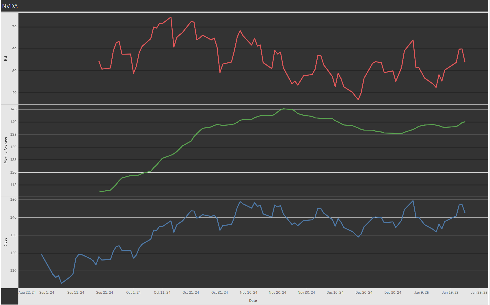
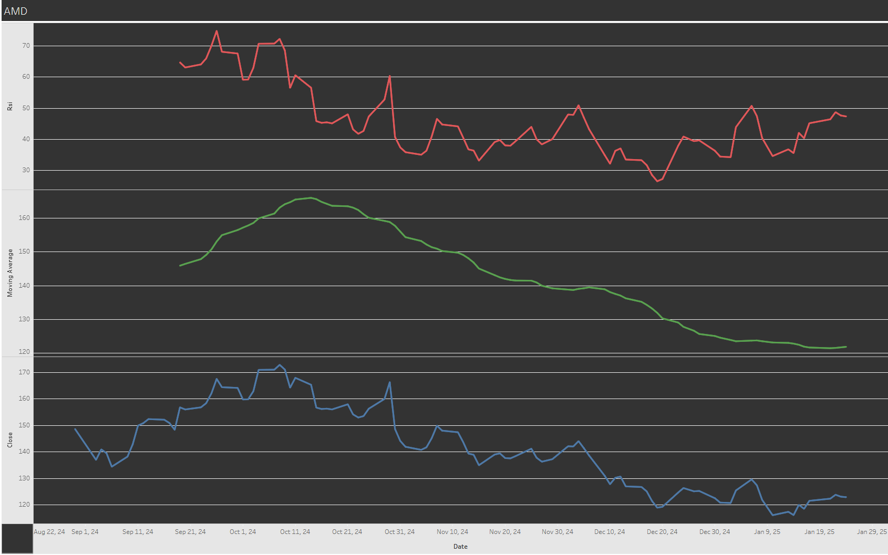

# finance-data-pipeline
A Python-based data pipeline for real-time stock market analysis using Alpha Vantage API. 

# Overview
This project demonstrates the creation of a finance data pipeline that collects daily stock data from the Alpha Vantage API, processes the data using Python libraries such as Polars and TA (Technical Analysis), stores it in a MySQL database, and visualizes the results in Tableau.

Key financial indicators such as the Relative Strength Index (RSI) and Simple Moving Average (SMA) are calculated and stored, enabling rich visual analytics.

# Features

Data Collection: Fetches stock data for multiple symbols (e.g., AMD, NVDA) using the Alpha Vantage API.

Data Processing: Computes financial indicators like RSI and SMA using Polars and TA libraries.

Database Storage: Stores the raw and processed data in a MySQL database for easy querying and long-term persistence.

Visualization: Exports processed data to CSV and visualizes it in Tableau to provide actionable insights.

Relative Strength Index (RSI): Displays momentum and potential overbought/oversold conditions.

Simple Moving Average (SMA): Highlights stock price trends over time.

# Images

In the chart above it shows the RSI and Simple Moving Average for NVDA in a monthly format. This can allow the user to make informed decisions on the stock market. 

In the chart above it shows the RSI and Simple Moving Average for AMD in a monthly format. This can allow the user to make informed decisions on the stock market. 

# Improvements

Currently the program provides information on a monthly interval which isn't great for making informed decisions. So, an improvement would be to use the alpha vantage api for the daily time series.

Another improvement is the means to have the program constantly running to be able to have a constant update of information.
